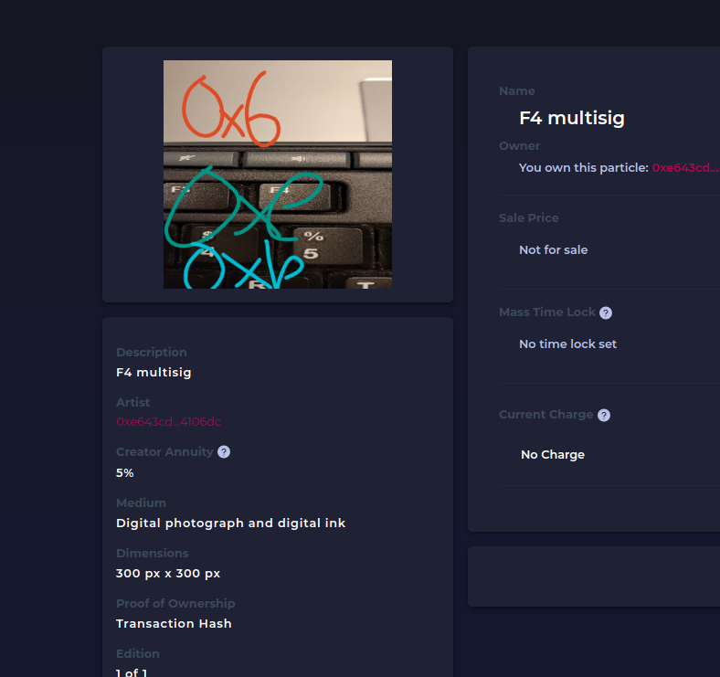

# SignPost

## Description

SignPost is a simple interface for autographing any picture or photo and then minting it as an ERC-721 on Ethereum using the Charged Particles Proton NFT contract.  App can be accessed at [https://signpost.vercel.app](https://signpost.vercel.app).

This app is currently deployed on the Kovan testnet and KovanETH can be acquired from the [testnet Gitter faucet](https://gitter.im/kovan-testnet/faucet).

Using the app on mobile

Seeing the autographed NFT on the Charged Particles marketplace

## Notes on usage

Due to testnet limitations, SignPost is currently accessible from your desktop browser via Metamask or else from the Metamask Mobile app on any mobile device.  Once mainnet capability is turned on, additional desktop and mobile wallets will be supported.  Also, because no major NFT marketplaces have testnet connectivity to Kovan, the minted NFTs are only currently available on the Charged Particles marketplace, [Kovan testnet edition](https://staging.charged.fi/).

