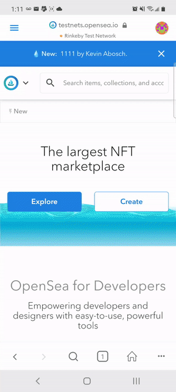

# SignPost

## Description

SignPost is a simple interface for autographing any picture or photo and then minting it as an ERC-721 compliant NFT on Ethereum.  App can be accessed at [https://signpost.vercel.app](https://signpost.vercel.app).

This app currently supports two testnets:
- the Charged Particles NFT contract on the Kovan testnet - [Etherscan link](https://kovan.etherscan.io/contract/0xD4F7389297d9cea850777EA6ccBD7Db5817a12b2)
- the Signpost V3 contract on the Rinkeby testnet - [Etherscan link](https://rinkeby.etherscan.io/contract/0x8D5A137F4973DB38317497F95540fa331D062638)

## Usage

### Single signature

- Connect to your preferred network (Kovan or Rinkeby)
- Select an image
- Autograph your image anywhere within the image itself
- Select "Autograph NFT" and then sign the message presented
- Select "Mint NFT" to mint on your preferred network

### Multiple signatures

#### First signature
- Connect to your preferred network (Kovan or Rinkeby)
- Select an image
- Autograph your image anywhere within the image itself
- Select "Autograph NFT" and then sign the message presented
- Copy the IPFS hash generated
- Send IPFS hash to next signer

#### Additional signatures
- Connect to prefered network
- Paste IPFS hash in text box
- Press "Load Autograph from IPFS"
- Autograph image
- Select "Autograph NFT" and then sign the message presented

#### Mint NFT (once all signatures are complete)
- Paste IPFS hash in text box
- Press "Load Autograph from IPFS"
- Select "Mint NFT" to mint on your preferred network

### Viewing your NFT
- Kovan 
    - Go to [Charged Particles](https://staging.charged.fi) and connect the wallet that minted the particle
    - View your NFT
- Rinkeby
    - Go to [Opensea](https://testnets.opensea.io) and connect the wallet that minted the particle
    - Go to your profile page and view your NFT

Minting an Autographed NFT on Rinkeby on mobile


Seeing the autographed NFT on the OpenSea marketplace


Minting an Autographed Charged Particle NFT on Kovan


Minting a multi-signature NFT on Rinkeby on mobile


Viewing a multi-signature NFT on Opensea


#### Verifying signatures
- Get the ABI for the contract ([Kovan Proton contract](./src/contracts/Proton.json) or [Rinkeby Signpost contract](./src/contracts/rinkebySignpost.json)) for which you've minted a token
- Navigate to the [MyEtherWallet Contract Interaction screen](https://www.myetherwallet.com/interface/interact-with-contract) and connect a wallet of your choice
- Copy the ABI from above into the ABI/JSON Interface field and the contract address into the Contract Address field
- Select the TokenURI function and put the number of the tokenId associated with the NFT you minted and click "Read"
- Copy the URL that appears in the result field into a new window and open it
- You should get a blob of JSON data with an array of signatures at the end
- Go back to the MyEtherWallet browser tab and select the "Message" button on the left and then select "Verify Message" from the list of choices
- Copy any set of one address, message, and signature values from the JSON blob into the template below (replacing the ones here with your own)
```
{
    "address":"0xE643cD48A9A902F6cE947324abE245b3Fe4106dc",
    "msg":"I autographed this message at 1616636106499",
    "sig":"0x31d4b0aabc2fb769d5cbd58239d112dd25c624103c23c04b99e45030524594215e1a3be6e1a079034e4cca80c64cf867576d276fe5b55d01492a71c113f492a91c"
}
```
- Paste your JSON object into the Signature text box on the MyEtherWallet tab and then press "Verify Message"
- You should see a confirmation message displayed validating that the indicated Ethereum private key associated with the address did sign the message

## Current Limitations due to Testnet deployment

- Only available on Kovan/Rinkeby
- Only supports following wallets
    - Desktop -Metamask and Torus
    - Mobile - Metamask Mobile, Opera Touch
- NFTs are only visible on OpenSea on Rinkeby 
- NFT metadata is currently stored on IPFS so not guaranteed to be preserved if additional pinning functionality is not built
